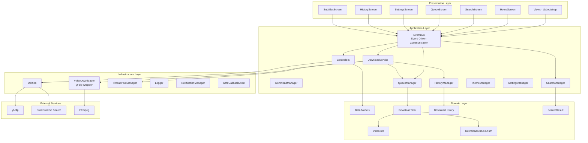

# Klyp Architecture Documentation

## Table of Contents

- [Overview](#overview)
- [Architecture Diagram](#architecture-diagram)
- [Layer Responsibilities](#layer-responsibilities)
- [Thread Safety](#thread-safety)
- [Concurrency Management](#concurrency-management)
- [Event System](#event-system)
- [Error Handling](#error-handling)

## Overview

Klyp is built on a modern, event-driven architecture that combines the Model-View-Controller (MVC) pattern with thread-safe design principles. The application is structured in four distinct layers that provide clear separation of concerns and maintainability.

### Architectural Principles

**Model-View-Controller (MVC)**

The application follows the MVC pattern to separate data, presentation, and business logic:

- **Models** (`models/`): Define data structures using Python dataclasses with validation
- **Views** (`views/`): Handle UI presentation using ttkbootstrap components
- **Controllers** (`controllers/`): Implement business logic and coordinate between models and views

**Event-Driven Architecture**

Communication between components is handled through an event-driven system:

- Decoupled components communicate via EventBus
- Worker threads publish events that are processed in the UI thread
- Asynchronous operations don't block the user interface

**Singleton Pattern**

Critical managers use the singleton pattern to ensure single instances:

- `EventBus`: Centralized event communication
- `QueueManager`: Single source of truth for download queue
- `DownloadService`: Coordinated download operations
- `ThreadPoolManager`: Centralized thread pool management

**Thread-Safe Design**

All concurrent operations are designed with thread safety in mind:

- Reentrant locks (`threading.RLock`) for queue operations
- Thread-safe queues (`queue.Queue`) for event communication
- UI updates always occur in the main thread
- Worker threads isolated from UI components


## Architecture Diagram

The following diagram illustrates the layered architecture and component relationships:



### Layer Responsibilities

**Presentation Layer**

- Renders UI components using ttkbootstrap
- Handles user input and interactions
- Subscribes to EventBus for updates
- Uses SafeCallbackMixin for thread-safe UI updates

**Application Layer**

- Implements business logic in controllers
- Coordinates between views and models
- Manages application state
- Publishes events for cross-component communication

**Domain Layer**

- Defines core data structures
- Implements validation logic
- Provides type safety with dataclasses
- Represents business entities

**Infrastructure Layer**

- Provides technical capabilities
- Wraps external libraries (yt-dlp, ffmpeg)
- Manages system resources (threads, files)
- Implements cross-cutting concerns (logging, notifications)

## Core Components

### Models (Domain Layer)

**VideoInfo** - Video metadata and information
- Stores URL, title, thumbnail, duration, author
- Available qualities and selected quality
- Subtitle download preferences
- Custom filename options

**DownloadTask** - Download task in queue
- Unique task identifier (UUID)
- Associated VideoInfo
- Status (QUEUED, DOWNLOADING, COMPLETED, FAILED, STOPPED)
- Progress tracking (0-100%)
- Download path and timestamps
- Error messages

**DownloadHistory** - Completed download records
- Historical download information
- File paths and sizes
- Completion timestamps
- Platform and quality information

**SearchResult** - Enriched search results
- Video metadata from search
- Platform categorization
- Quality information
- View counts and engagement metrics

**DownloadStatus** - Status enumeration
- QUEUED, DOWNLOADING, COMPLETED, FAILED, STOPPED

### Views (Presentation Layer)

**HomeScreen** - Main interface
- URL input and video info display
- Quality selection
- Add to queue functionality

**SearchScreen** - Video search
- Search query input
- Advanced filters
- Result display with metadata
- Platform-specific presets

**QueueScreen** - Download queue management
- Task list with status
- Start/stop controls
- Progress tracking
- Queue operations (remove, clear, reorder)

**HistoryScreen** - Download history
- Completed downloads list
- Search and filter
- Statistics display
- File access

**SettingsScreen** - Application configuration
- Download directory
- Theme selection
- Proxy settings
- Advanced options

**SubtitlesScreen** - Subtitle downloads
- URL input
- Language selection
- Format options

### Controllers (Application Layer)

**QueueManager** - Queue operations (Singleton)
- Thread-safe queue management
- Add, remove, update tasks
- Status filtering
- Queue persistence (import/export)
- Auto-resume support

**DownloadService** - Download coordination (Singleton)
- Start/stop downloads
- Concurrent download management (max 3)
- Progress tracking
- History integration
- Event publishing

**SearchManager** - Video search (Singleton)
- DuckDuckGo integration
- Filter application
- Result enrichment
- Async search support

**HistoryManager** - History persistence
- JSON storage
- Add/remove records
- Search functionality
- Statistics generation

**SettingsManager** - Configuration (Singleton)
- Thread-safe settings access
- JSON persistence
- Default values
- Event publishing on changes

**ThemeManager** - Theme management
- Dark/light theme switching
- Icon set management
- UI updates

### Utils (Infrastructure Layer)

**VideoDownloader** - yt-dlp wrapper
- Video info extraction
- Download with progress callbacks
- Subtitle support
- Format selection
- Cookie-based authentication

**EventBus** - Event system (Singleton)
- Thread-safe event publishing
- Subscription management
- UI thread event processing
- Queue-based communication

**ThreadPoolManager** - Thread pools (Singleton)
- Separate pools for downloads and searches
- Lazy initialization
- Graceful shutdown
- Worker limits (3 per pool)

**Logger** - Structured logging
- File and console output
- Log rotation
- Debug mode support
- Exception tracking

**NotificationManager** - Desktop notifications
- Cross-platform notifications
- Download completion alerts
- Error notifications

**SafeCallbackMixin** - Thread-safe callbacks
- UI thread scheduling
- Safe callback execution
- Error handling

## Design Patterns

### Singleton Pattern

Critical managers use singleton pattern to ensure single instances across the application.

**Implementation:**

```python
class QueueManager:
    _instance = None
    _lock = threading.Lock()
    
    def __new__(cls):
        if cls._instance is None:
            with cls._lock:
                if cls._instance is None:
                    cls._instance = super().__new__(cls)
        return cls._instance
```

**Used in:**
- EventBus - Centralized event communication
- QueueManager - Single source of truth for download queue
- DownloadService - Coordinated download operations
- ThreadPoolManager - Centralized thread pool management
- SettingsManager - Shared configuration access

**Benefits:**
- Single source of truth
- Shared state management
- Resource coordination
- Thread-safe initialization

### Event-Driven Architecture

Components communicate through an event-driven system using EventBus.

**Flow:**

```
Worker Thread → EventBus.publish() → queue.Queue → UI Thread → EventBus.process_events() → Callbacks
```

**Event Types:**
- DOWNLOAD_PROGRESS - Progress updates
- DOWNLOAD_COMPLETE - Download finished
- DOWNLOAD_FAILED - Download error
- SEARCH_COMPLETE - Search results ready
- QUEUE_UPDATED - Queue modified
- SETTINGS_CHANGED - Configuration updated

**Benefits:**
- Decoupled components
- Thread-safe communication
- Asynchronous operations
- UI responsiveness

### MVC Pattern

Clear separation between data, presentation, and business logic.

**Model** (models/)
- Data structures using dataclasses
- Validation logic
- Type safety

**View** (views/)
- UI components with ttkbootstrap
- User interaction handling
- Display logic

**Controller** (controllers/)
- Business logic
- Coordination between models and views
- State management

**Benefits:**
- Separation of concerns
- Testability
- Maintainability
- Clear responsibilities

### Observer Pattern

EventBus implements publish-subscribe (observer) pattern.

**Publishers:**
- DownloadService - Download events
- SearchManager - Search events
- QueueManager - Queue events
- SettingsManager - Settings events

**Subscribers:**
- UI screens subscribe to relevant events
- Update displays based on events
- React to state changes

**Benefits:**
- Loose coupling
- Dynamic subscriptions
- Multiple observers
- Event filtering


## Thread Safety

Klyp implements comprehensive thread-safety mechanisms to ensure reliable concurrent operations.

### Locking Strategies

**Reentrant Locks (RLock)**

Used in QueueManager and SettingsManager to allow the same thread to acquire the lock multiple times.

```python
self._lock = threading.RLock()

def add_task(self, video_info):
    with self._lock:
        # Can call other methods that also acquire the lock
        if not self.is_url_in_queue(video_info.url):
            # Add task logic
            pass
```

**Benefits:**
- Prevents deadlocks in recursive calls
- Simplifies method composition
- Thread-safe method chaining

**Simple Locks**

Used for basic mutual exclusion in singleton initialization.

```python
_lock = threading.Lock()

def __new__(cls):
    if cls._instance is None:
        with cls._lock:
            if cls._instance is None:
                cls._instance = super().__new__(cls)
    return cls._instance
```

### Thread-Safe Communication

**Queue-Based Events**

EventBus uses `queue.Queue` for thread-safe event passing between worker threads and UI thread.

```python
self._event_queue = queue.Queue(maxsize=1000)

def publish(self, event):
    """Can be called from any thread"""
    try:
        self._event_queue.put_nowait(event)
        return True
    except queue.Full:
        return False

def process_events(self):
    """Called only from UI thread"""
    while not self._event_queue.empty():
        event = self._event_queue.get_nowait()
        self._dispatch_event(event)
```

**Benefits:**
- No locks needed for event publishing
- Automatic synchronization
- Bounded queue prevents memory leaks
- Non-blocking operations

### UI Thread Safety

**SafeCallbackMixin**

Ensures UI updates always occur in the main thread.

```python
class SafeCallbackMixin:
    def safe_callback(self, callback, *args, **kwargs):
        """Schedule callback in UI thread"""
        if self.root:
            self.root.after(0, lambda: callback(*args, **kwargs))
```

**Usage:**
- All UI screens inherit from SafeCallbackMixin
- Worker threads use safe_callback for UI updates
- Prevents Tkinter thread-safety issues

### Data Protection

**Immutable Returns**

Methods return copies of mutable data to prevent external modification without locks.

```python
def get_all_tasks(self):
    """Return copy of task list"""
    with self._lock:
        return self._tasks.copy()
```

**Benefits:**
- Prevents race conditions
- Maintains data integrity
- Clear ownership semantics

## Concurrency Management

### ThreadPoolManager

Centralized management of thread pools with proper lifecycle.

**Architecture:**

```python
class ThreadPoolManager:
    _download_pool = None
    _search_pool = None
    _lock = threading.Lock()
    
    @property
    def download_pool(self):
        """Lazy initialization of download pool"""
        if self._download_pool is None:
            with self._lock:
                if self._download_pool is None:
                    self._download_pool = ThreadPoolExecutor(
                        max_workers=3,
                        thread_name_prefix="download_worker"
                    )
        return self._download_pool
```

**Configuration:**
- Download pool: 3 workers maximum
- Search pool: 3 workers maximum
- Lazy initialization (created on first use)
- Named threads for debugging

**Benefits:**
- Resource limits prevent system overload
- Separate pools prevent resource contention
- Graceful shutdown with timeout
- Thread naming aids debugging

### Download Concurrency

**DownloadService** manages concurrent downloads with limits.

**Flow:**

1. Check active download count
2. If under limit (3), start download in thread pool
3. Track Future object for cancellation
4. Publish progress events
5. On completion, update history and queue
6. Remove from active downloads

**Cancellation:**

```python
def stop_download(self, task_id):
    """Stop a specific download"""
    if task_id in self._active_downloads:
        # Set cancellation event
        self._cancel_events[task_id].set()
        # Cancel future
        self._active_downloads[task_id].cancel()
```

**Benefits:**
- Prevents system overload
- Responsive cancellation
- Progress tracking
- Resource cleanup

### Search Concurrency

**SearchManager** uses separate thread pool for searches.

**Benefits:**
- Searches don't block downloads
- Multiple concurrent searches
- Async search with callbacks
- Independent resource pool

## Event System

### EventBus Architecture

Central event-driven communication system.

**Components:**

1. **Event Queue** - Thread-safe queue for events
2. **Subscribers** - Callbacks registered for event types
3. **Processing Loop** - UI thread processes events periodically

**Event Structure:**

```python
@dataclass
class Event:
    type: EventType
    data: Dict[str, Any]
    timestamp: datetime = field(default_factory=datetime.now)
```

### Event Types

**Download Events:**
- DOWNLOAD_PROGRESS - Progress updates (task_id, progress, status)
- DOWNLOAD_COMPLETE - Download finished (task_id, file_path)
- DOWNLOAD_FAILED - Download error (task_id, error)
- DOWNLOAD_STOPPED - User stopped download (task_id)

**Search Events:**
- SEARCH_COMPLETE - Search results ready (query, results)
- SEARCH_FAILED - Search error (query, error)

**Queue Events:**
- QUEUE_UPDATED - Queue modified (action, task_id, task_count)

**Settings Events:**
- SETTINGS_CHANGED - Configuration updated (changed_keys, settings)

### Event Flow

**Publishing (from any thread):**

```python
event_bus.publish(Event(
    type=EventType.DOWNLOAD_PROGRESS,
    data={"task_id": "123", "progress": 50.0}
))
```

**Subscribing (from UI thread):**

```python
def on_progress(event):
    task_id = event.data["task_id"]
    progress = event.data["progress"]
    # Update UI

sub_id = event_bus.subscribe(EventType.DOWNLOAD_PROGRESS, on_progress)
```

**Processing:**

EventBus processes events every 100ms in UI thread:

```python
def process_events(self):
    """Process up to 100 events per cycle"""
    processed = 0
    while not self._event_queue.empty() and processed < 100:
        event = self._event_queue.get_nowait()
        self._dispatch_event(event)
        processed += 1
    
    # Schedule next processing
    self.root.after(100, self.process_events)
```

**Benefits:**
- Prevents UI freezing (max 100 events per cycle)
- Regular processing interval
- Bounded queue prevents memory leaks
- Thread-safe publishing

## Error Handling

### Exception Hierarchy

Custom exception hierarchy for granular error handling.

```python
DownloadException (base)
├── NetworkException          # Network/connection errors
├── AuthenticationException   # Authentication required
├── FormatException          # Format unavailable
├── ExtractionException      # Metadata extraction failed
└── SearchException          # Search operation failed
```

### Error Classification

**Automatic yt-dlp Error Classification:**

```python
def classify_yt_dlp_error(error_message: str) -> Type[DownloadException]:
    """Classify yt-dlp error into specific exception type"""
    if any(keyword in error_message.lower() for keyword in 
           ['network', 'connection', 'timeout', 'unreachable']):
        return NetworkException
    elif any(keyword in error_message.lower() for keyword in
             ['login', 'authentication', 'private', 'members-only']):
        return AuthenticationException
    elif any(keyword in error_message.lower() for keyword in
             ['format', 'quality', 'unavailable']):
        return FormatException
    else:
        return ExtractionException
```

**Benefits:**
- Specific error handling
- User-friendly error messages
- Recovery strategies
- Detailed logging

### Error Recovery

**Retry Logic:**

Downloads can be retried with exponential backoff:

```python
max_retries = 3
for attempt in range(max_retries):
    try:
        download_video(url)
        break
    except NetworkException as e:
        if attempt < max_retries - 1:
            delay = 2 ** attempt  # Exponential backoff
            time.sleep(delay)
        else:
            raise
```

**Graceful Degradation:**

- Network errors: Suggest checking connection
- Authentication errors: Prompt for cookies file
- Format errors: Suggest alternative quality
- Extraction errors: Report to user with details

### Structured Error Logging

**Context-Rich Logging:**

```python
logger.log_exception_structured(
    exception=e,
    context={
        "task_id": task.id,
        "url": task.video_info.url,
        "quality": task.video_info.selected_quality,
        "operation": "download"
    },
    message="Download failed"
)
```

**Benefits:**
- Detailed error context
- Easier debugging
- Pattern identification
- User support

### User-Facing Errors

**Error Messages:**

Errors are translated to user-friendly messages:

- NetworkException → "Network connection failed. Please check your internet connection."
- AuthenticationException → "This video requires authentication. Please provide a cookies file in Settings."
- FormatException → "The requested quality is not available. Try a different quality."
- ExtractionException → "Failed to extract video information. The URL may be invalid."

**Error Display:**

- Toast notifications for minor errors
- Dialog boxes for critical errors
- Status updates in queue screen
- Detailed logs for debugging

---

**Last Updated:** 2024
**Version:** 1.0
